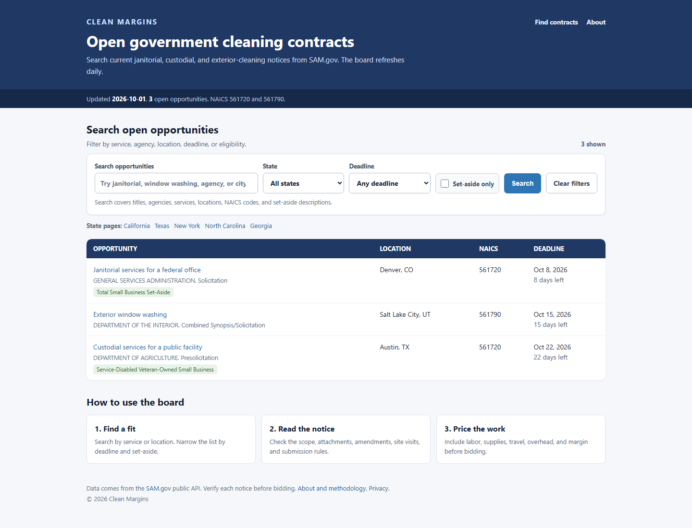

<p align="center">
  
</p>

# Clean Margins

Clean Margins is a searchable board for open government cleaning contracts.

## What it does

The site pulls public notices from SAM.gov, keeps cleaning work that fits the board, removes expired or repeated listings, and stores the current list in Cloudflare KV. Visitors can search by keyword, state, deadline, and set-aside status. The site can also connect to a Beehiiv signup form and product links when those settings are supplied.



## Quick start

You need Node.js 20 or newer. These steps run the site with the safe sample records in this repository. No API key is needed.

Windows PowerShell:

```powershell
git clone https://github.com/kaidenleeds/clean-margins.git
Set-Location clean-margins
npm install --global pnpm@11.25.0
Copy-Item .env.example .env
pnpm install
pnpm run dev
```

macOS or Linux:

```bash
git clone https://github.com/kaidenleeds/clean-margins.git
cd clean-margins
npm install --global pnpm@11.25.0
cp .env.example .env
pnpm install
pnpm run dev
```

Open `http://localhost:8787`. Stop the server with `Ctrl+C`.

## How the pipeline works

1. A scheduled Cloudflare Worker requests recent notices from the SAM.gov Opportunities API.
2. Each record must match NAICS 561720 or a cleaning-related title under NAICS 561790.
3. The pipeline normalizes locations, dates, set-asides, and source links.
4. Expired notices and repeated listings are removed.
5. The clean snapshot is written to Cloudflare KV.
6. The Worker renders the board, state pages, filters, sitemap, newsletter form, and optional product links.

The Python pipeline mirrors the main fetch and cleanup rules. It is useful for local checks and JSON or CSV exports.

## Tech stack

- Cloudflare Workers and KV
- JavaScript modules with HTML and CSS rendered at the edge
- Node.js tests and build scripts
- Python standard library for local data exports
- Beehiiv API for optional newsletter signups
- SAM.gov Opportunities API for public contract data

## Project structure

| Path | Purpose |
| --- | --- |
| `src/worker.js` | Routes, security headers, subscriptions, metrics, and scheduled refreshes |
| `src/data.js` | SAM.gov requests, filtering, normalization, and deduplication |
| `src/render.js` | Pages, search results, forms, and public copy |
| `src/styles.js` | Site styles and responsive layout |
| `pipeline/` | Local Python export pipeline |
| `tests/` | JavaScript and Python regression tests |
| `scripts/` | Local server, production build, and smoke test |
| `examples/` | Safe sample contract data |
| `wrangler.jsonc.example` | Cloudflare configuration template with fake IDs |

## Full development setup

The Python tools need Python 3.11 or newer. Start with the quick-start steps above, then create the Python environment.

PowerShell:

```powershell
python -m venv .venv
.\.venv\Scripts\python -m pip install -r requirements-dev.txt
pnpm run check
```

macOS or Linux:

```bash
python3 -m venv .venv
.venv/bin/python -m pip install -r requirements-dev.txt
pnpm run check
```

`pnpm run check` runs JavaScript and Python linting, all tests, the type check, the production build, and the local smoke test.

## Environment variables

| Name | Required in production | Use |
| --- | --- | --- |
| `SAM_API_KEY` | Yes | Reads public opportunities from SAM.gov |
| `BEEHIIV_API_KEY` | Only for signups | Adds subscribers through Beehiiv |
| `BEEHIIV_PUBLICATION_ID` | Only for signups | Selects the Beehiiv publication |
| `ADMIN_KEY` | Yes for admin routes | Protects manual refresh and metrics requests |
| `PUBLIC_ORIGIN` | Yes | Sets canonical and sitemap URLs |
| `PRODUCT_BUNDLE_URL` | No | Enables the bundle card and redirect |
| `PRODUCT_BID_CALCULATOR_URL` | No | Enables the bid calculator card and redirect |
| `PRODUCT_BUSINESS_OS_URL` | No | Enables the business workbook card and redirect |
| `PRODUCT_PRESSURE_WASHING_URL` | No | Enables the pressure-washing tool card and redirect |
| `PORT` | No | Changes the local server port from `8787` |

Keep real values in `.env`, `.dev.vars`, or Cloudflare secrets. The example files contain empty values and a local URL.

## Commands

Start the sample site:

```powershell
pnpm run dev
```

Run every lint check:

```powershell
pnpm run lint
```

Run only the JavaScript or Python lint check:

```powershell
pnpm run lint:js
pnpm run lint:python
```

Run every test:

```powershell
pnpm test
```

Check JavaScript types:

```powershell
pnpm run type-check
```

Build the Worker bundle:

```powershell
pnpm run build
```

Run the local smoke test:

```powershell
pnpm run smoke
```

Run the complete project check:

```powershell
pnpm run check
```

Create safe local JSON and CSV output:

```powershell
python pipeline\fetch_opportunities.py --mock
```

Create a live local export after setting `SAM_API_KEY`:

```powershell
python pipeline\fetch_opportunities.py
```

Generated exports go to `data/generated/`, which Git ignores.

## Cloudflare deployment

1. Copy `wrangler.jsonc.example` to `wrangler.jsonc`.
2. Create a KV namespace and place its real IDs in the local config.
3. Set `PUBLIC_ORIGIN` and any public links under `vars`.
4. Store the three private values with Wrangler:

```powershell
pnpm exec wrangler secret put SAM_API_KEY
pnpm exec wrangler secret put BEEHIIV_API_KEY
pnpm exec wrangler secret put ADMIN_KEY
```

5. Build and deploy:

```powershell
pnpm run build
pnpm exec wrangler deploy --config wrangler.jsonc
```

The admin endpoints accept the key through an `Authorization: Bearer` header. The key stays out of URLs and access logs.

## Safety checks in the code

- SAM.gov links must use HTTPS and a `sam.gov` host.
- NAICS 561790 records need cleaning-related words in the title.
- Listings with matching title, agency, location, and deadline are collapsed into one row.
- Newsletter forms use basic email validation, a hidden bot field, and a same-origin check.
- HTML responses include a content security policy and other browser security headers.
- Generated snapshots, local settings, credentials, paid workbooks, and build output are excluded from Git.
